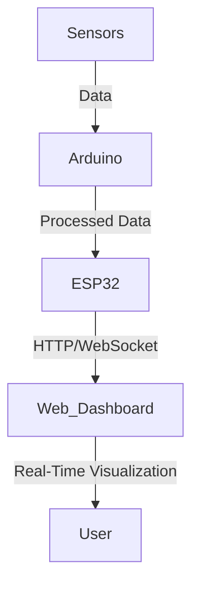

# 🛸 Drone-Based Intelligent Magnetic Sensing System


## 📌 Project Overview
The **Drone-Based Intelligent Magnetic Sensing System** is a sophisticated UAV platform designed for environmental and geological monitoring. Leveraging advanced sensors, real-time monitoring, and a custom dashboard, this project offers a unique, scalable solution for a range of applications like mining, safety inspections, and terrain analysis.

---

## 🎯 Key Features
- **High-Precision Magnetic Sensing**: Using HMC5883L Magnetometer for detailed geological mapping.
- **Real-Time Data Streaming**: Continuous data flow via ESP32 for live monitoring on a web dashboard.
- **Sensor Fusion**: Multiple sensors (Hall Effect, Ultrasonic, Inductive Proximity, MPU6050) controlled by Arduino Mega.
- **Custom Data Dashboard**: Real-time visualization with dynamic alerts.

---

## 🛠️ Technical Specifications

### 🔩 Hardware Components
- **Drone Platform**: Quadcopter, S500 Frame, 1400KV Brushless DC motors
- **Controllers**: Arduino Mega 2560, ESP32
- **Sensors**:
  - Magnetic Sensor (HMC5883L)
  - Hall Effect Sensor (HW484)
  - Inductive Proximity Sensor
  - Ultrasonic Distance Sensor (HC-SR04)
- **Additional Modules**:
  - GPS (M8N)
  - Real-Time Kinematic (RTK) System
  - Pixhawk 2.4.8 Flight Controller

### 💻 Software Requirements
- **Operating System**: Linux, Windows, or MacOS
- **IDEs**: Visual Studio Code, Arduino IDE, Mission Plan
- **Database**: MySQL or MongoDB
- **Languages and Protocols**: C++, Python, HTTP, WebSockets

---

## 📈 Functional Diagram
The following schematic illustrates the data flow from sensors to the dashboard:



---

## 🚀 Installation and Setup

### 1️⃣ Hardware Setup
   - Assemble the drone and integrate sensors as per the [hardware schematic](https://github.com/pruthvihosmani/Drone-Based-Intelligent-Magnetic-Sensing-System).

### 2️⃣ Arduino and ESP32 Configuration
   - Upload Arduino code to control sensors and send data to ESP32.
   - Connect ESP32 to Wi-Fi and set up HTTP/WebSocket communication.

### 3️⃣ Web Dashboard
   - Install required dependencies:
     ```bash
     npm install express socket.io serialport
     ```
   - Run the server:
     ```bash
     node server.js
     ```
   - Open `index.html` in a browser for real-time dashboard access.

---

## 📊 Project Highlights

### 🔍 Real-Time Data Visualization
The project features a live dashboard to track and visualize multiple sensor streams, including:
- **Accelerometer**: 3-axis data for stability monitoring.
- **Magnetic Field**: 3D magnetic data for geological assessment.
- **Distance**: Ultrasonic height measurement.
- **Metallic Presence**: Inductive sensor data for detecting metal objects.

### 💼 Applications
- **Mining**: Efficient mineral exploration, terrain mapping, and reclamation.
- **Environmental Safety**: Hazard detection in inaccessible areas.
- **Remote Surveillance**: Infrastructure maintenance and safety monitoring.

---

## 🛤️ Future Enhancements
- **AI Integration**: Machine learning for predictive maintenance.
- **Enhanced Networking**: Multi-drone coordination for large-scale deployments.
- **Cloud Storage**: Scalable data logging and analytics via cloud services.

---

## 🤝 Contributing
We welcome contributions! Please fork the repository, make changes, and submit a pull request for review.

## 📬 Contact
For questions or collaboration, please reach out via [hosamani.pruthvi@gmail.com](mailto:hosamani.pruthvi@gmail.com).

