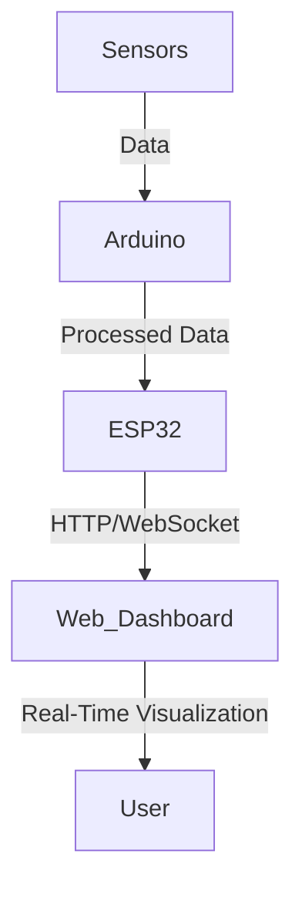

# Drone-Based Intelligent Magnetic Sensing System

## Project Overview
This project develops an unmanned aerial vehicle (UAV) with an intelligent magnetic sensing system designed for environmental and geological monitoring. With applications ranging from mining to safety inspections, the system integrates real-time data acquisition and monitoring capabilities, offering a unique solution for mapping and assessing various terrains with enhanced efficiency and precision.

## Key Features
- **Magnetic Sensing**: High-precision magnetic field detection using HMC5883L Magnetometer for geological mapping.
- **Real-Time Monitoring**: Continuous data transfer through an ESP32 module, enabling live data tracking on a customized web dashboard.
- **Sensor Fusion**: Integrates multiple sensors including Hall Effect, ultrasonic, inductive proximity, and MPU6050 accelerometer, all controlled by an Arduino Mega.
- **Data Visualization**: A web-based dashboard to visualize sensor data, with Chart.js and real-time alerts for height and metallic presence.

## Technical Specifications

### Hardware Components
- **Drone Platform**: Quadcopter with S500 Frame and 1400KV Brushless DC motors
- **Microcontrollers**: Arduino Mega 2560 and ESP32
- **Sensors**: 
  - Magnetic Sensor (HMC5883L)
  - Hall Effect Sensor (HW484)
  - Inductive Proximity Sensor
  - Ultrasonic Distance Sensor (HC-SR04)
- **Additional Modules**:
  - GPS (M8N)
  - Real-Time Kinematic (RTK) system
  - Pixhawk 2.4.8 Flight Controller

### Software Requirements
- **Operating System**: Linux, Windows, or MacOS
- **Integrated Development Environments (IDEs)**: Visual Studio Code, Arduino IDE, Mission Plan
- **Database**: MySQL or MongoDB (for data logging and analytics)
- **Languages and Protocols**: C++, Python, HTTP, WebSockets

### Functional Diagram
The following schematic illustrates the data flow from sensors to the dashboard:


## Installation and Setup

1. **Hardware Setup**: Assemble the drone components and integrate sensors as per the [hardware schematic](link to schematic if available).
2. **Arduino and ESP32 Configuration**:
   - Upload Arduino code to control sensors and send data to ESP32.
   - Connect ESP32 to Wi-Fi and configure HTTP/WebSocket communication.
3. **Web Dashboard**:
   - Install dependencies:
     ```bash
     npm install express socket.io serialport
     ```
   - Run the server:
     ```bash
     node server.js
     ```
   - Open `index.html` in a browser to view the dashboard.

## Project Highlights

### Real-Time Data Visualization
A live dashboard visualizes data streams from multiple sensors, providing comprehensive environmental monitoring insights. Key data points include:
- **Accelerometer**: 3-axis data tracking for stability and motion detection.
- **Magnetic Field**: 3D magnetic field strength for geological analysis.
- **Distance**: Height measurement and obstacle detection through ultrasonic sensors.
- **Metallic Presence**: Inductive sensor data for detecting metal objects.

### Applications
- **Mining**: Efficient mineral exploration, terrain mapping, and reclamation phase monitoring.
- **Environmental Safety**: Hazard detection in hard-to-reach locations.
- **Remote Surveillance**: Real-time monitoring and data-driven insights for infrastructure maintenance and safety inspections.

## Future Enhancements
Potential improvements include:
- **AI Integration**: Machine learning models for predictive maintenance and terrain anomaly detection.
- **Enhanced Networking**: Multi-drone network coordination for large-scale operations.
- **Cloud Data Storage**: Transition to cloud storage for scalable data logging and analytics.

## Contributing
If you'd like to contribute, please fork the repository, make your changes, and submit a pull request. Contributions are welcome for code enhancements, documentation, and feature additions.

## Contact
For questions or collaboration opportunities, please reach out via [hosamani.pruthvi@gmail.com](mailto:hosamani.pruthvi@gmail.com).

---
